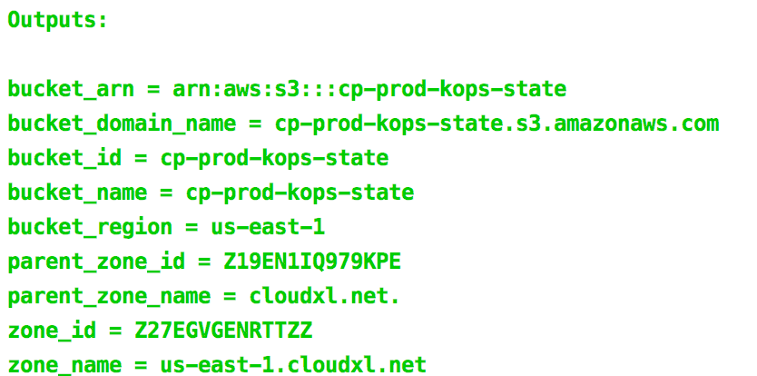

# terraform-aws-kops-state-backend [](https://travis-ci.org/cloudposse/terraform-aws-kops-state-backend)

Terraform module to provision dependencies for `kops` (config S3 bucket & DNS zone).

The module supports the following:

1. Forced server-side encryption at rest for the S3 bucket
2. S3 bucket versioning to allow for `kops` state recovery in the case of accidental deletions or human errors


## Usage

This example will create a DNS zone called `kops.cloudxl.net` and delegate it from the parent zone `cloudxl.net` by setting `NS` and `SOA` records in the parent zone.

It will also create an S3 bucket with the name `cp-prod-kops-state` for storing `kops` manifests.

```
module "kops" {
  source           = "git::https://github.com/cloudposse/terraform-aws-kops-state-backend.git?ref=master"
  namespace        = "cp"
  stage            = "prod"
  name             = "kops"
  attributes       = ["state"]
  parent_zone_name = "cloudxl.net"
  zone_name        = "$${name}.$${parent_zone_name}"
  region           = "us-east-1"
}
```

<br/>



To check that the created `kops` DNS zone has been tagged correctly, run

```bash
aws route53 list-tags-for-resources --resource-type hostedzone --resource-ids Z58RWQWFVU4HT
```


```json
{
    "ResourceTagSets": [
        {
            "ResourceType": "hostedzone",
            "ResourceId": "Z2P8BG2BJMCYDV",
            "Tags": [
                {
                    "Key": "Cluster",
                    "Value": "kops.cloudxl.net"
                },
                {
                    "Key": "Stage",
                    "Value": "prod"
                },
                {
                    "Key": "Namespace",
                    "Value": "cp"
                },
                {
                    "Key": "Name",
                    "Value": "cp-prod-kops-state"
                }
            ]
        }
    ]
}
```


## Variables

__NOTE:__ One of `parent_zone_name` or `parent_zone_id` is required, but not both.
The module will lookup the parent zone by either name or ID.


|  Name                    |  Default                          |  Description                                                                      | Required |
|:-------------------------|:----------------------------------|:----------------------------------------------------------------------------------|:--------:|
| `namespace`              | ``                                | Namespace (_e.g._ `cp` or `cloudposse`)                                           | Yes      |
| `stage`                  | ``                                | Stage (_e.g._ `prod`, `dev`, `staging`)                                           | Yes      |
| `region`                 | `us-east-1`                       | AWS Region the S3 bucket should reside in                                         | Yes      |
| `parent_zone_name`       | ``                                | Parent DNS zone name (e.g. `domain.com`). Required if `parent_zone_id` is not provided    | Yes      |
| `parent_zone_id`         | ``                                | Parent DNS zone ID. Required if `parent_zone_name` is not provided                | Yes      |
| `name`                   | `kops`                            | Name  (_e.g._ `kops`)                                                             | No       |
| `attributes`             | `["state"]`                       | Additional attributes (_e.g._ `state`)                                            | No       |
| `tags`                   | `{}`                              | Additional tags  (_e.g._ `map("BusinessUnit","XYZ")`                              | No       |
| `delimiter`              | `-`                               | Delimiter to be used between `namespace`, `stage`, `name`, and `attributes`       | No       |
| `acl`                    | `private`                         | The canned ACL to apply to the S3 bucket                                          | No       |
| `zone_name`              | `$${name}.$${parent_zone_name}`   | Template for `kops` DNS zone name                                                 | No       |
| `force_destroy`          | `false`                           | A boolean that indicates all objects should be deleted from the bucket so that the bucket can be destroyed without errors   | No       |


## Outputs

| Name                   | Description               |
|:-----------------------|:--------------------------|
| `parent_zone_id`       | Parent zone ID            |
| `parent_zone_name`     | Parent zone name          |
| `zone_id`              | `kops` zone ID            |
| `zone_name`            | `kops` zone name          |
| `bucket_name`          | S3 bucket name            |
| `bucket_region`        | S3 bucket region          |
| `bucket_domain_name`   | S3 bucket domain name     |
| `bucket_id`            | S3 bucket ID              |
| `bucket_arn`           | S3 bucket ARN             |


## Help

**Got a question?**

File a GitHub [issue](https://github.com/cloudposse/terraform-aws-kops-state-backend/issues), send us an [email](mailto:hello@cloudposse.com) or reach out to us on [Gitter](https://gitter.im/cloudposse/).


## Contributing

### Bug Reports & Feature Requests

Please use the [issue tracker](https://github.com/cloudposse/terraform-aws-kops-state-backend/issues) to report any bugs or file feature requests.

### Developing

If you are interested in being a contributor and want to get involved in developing `terraform-aws-kops-state-backend`, we would love to hear from you! Shoot us an [email](mailto:hello@cloudposse.com).

In general, PRs are welcome. We follow the typical "fork-and-pull" Git workflow.

 1. **Fork** the repo on GitHub
 2. **Clone** the project to your own machine
 3. **Commit** changes to your own branch
 4. **Push** your work back up to your fork
 5. Submit a **Pull request** so that we can review your changes

**NOTE:** Be sure to merge the latest from "upstream" before making a pull request!


## License

[APACHE 2.0](LICENSE) © 2017-2018 [Cloud Posse, LLC](https://cloudposse.com)

See [LICENSE](LICENSE) for full details.

    Licensed to the Apache Software Foundation (ASF) under one
    or more contributor license agreements.  See the NOTICE file
    distributed with this work for additional information
    regarding copyright ownership.  The ASF licenses this file
    to you under the Apache License, Version 2.0 (the
    "License"); you may not use this file except in compliance
    with the License.  You may obtain a copy of the License at

      http://www.apache.org/licenses/LICENSE-2.0

    Unless required by applicable law or agreed to in writing,
    software distributed under the License is distributed on an
    "AS IS" BASIS, WITHOUT WARRANTIES OR CONDITIONS OF ANY
    KIND, either express or implied.  See the License for the
    specific language governing permissions and limitations
    under the License.


## About

`terraform-aws-kops-state-backend` is maintained and funded by [Cloud Posse, LLC][website].


Like it? Please let us know at <hello@cloudposse.com>

We love [Open Source Software](https://github.com/cloudposse/)!

See [our other projects][community]
or [hire us][hire] to help build your next cloud platform.

  [website]: https://cloudposse.com/
  [community]: https://github.com/cloudposse/
  [hire]: https://cloudposse.com/contact/


### Contributors

| [![Erik Osterman][erik_img]][erik_web]<br/>[Erik Osterman][erik_web] | [![Andriy Knysh][andriy_img]][andriy_web]<br/>[Andriy Knysh][andriy_web] |
|-------------------------------------------------------|------------------------------------------------------------------|

  [erik_img]: http://s.gravatar.com/avatar/88c480d4f73b813904e00a5695a454cb?s=144
  [erik_web]: https://github.com/osterman/
  [andriy_img]: https://avatars0.githubusercontent.com/u/7356997?v=4&u=ed9ce1c9151d552d985bdf5546772e14ef7ab617&s=144
  [andriy_web]: https://github.com/aknysh/
